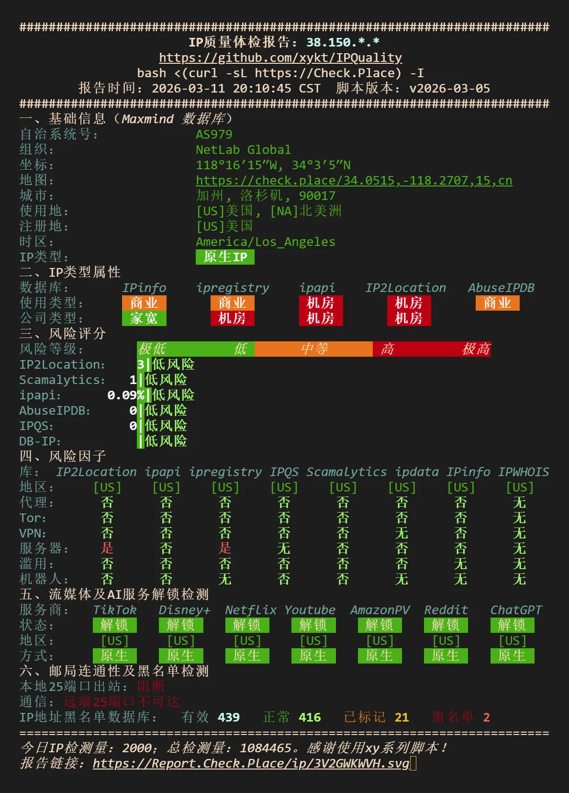
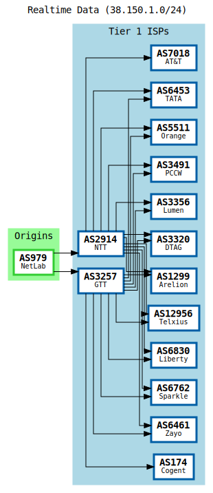
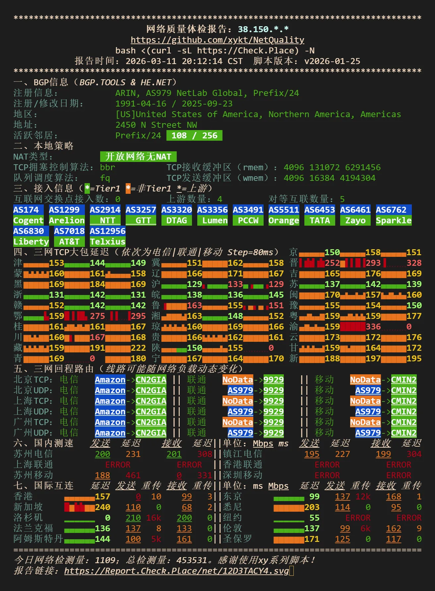
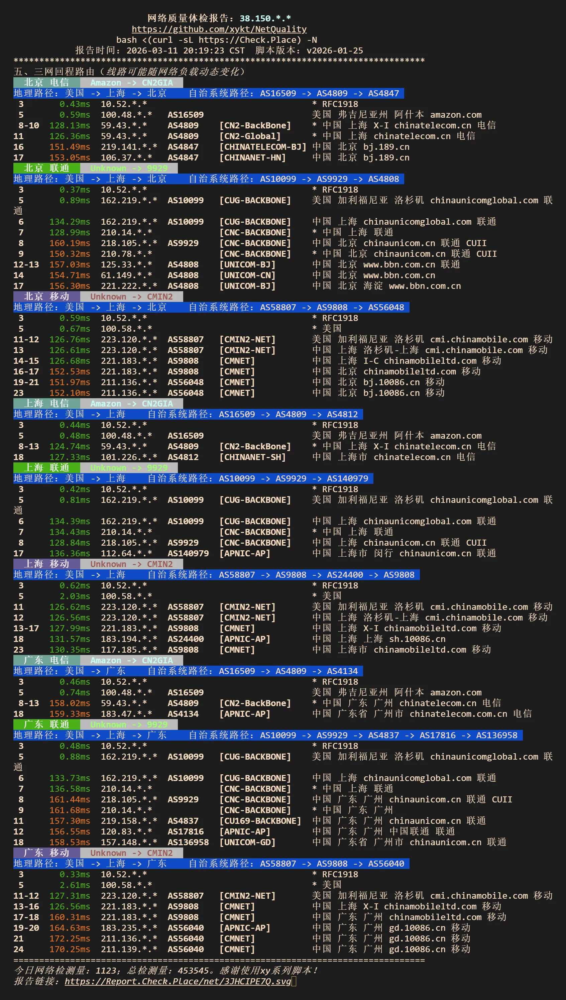

:::tip[观前提示]
本贴的含 `AFF` 链接会有标注并附上对应的无 `AFF` 链接
测试机型: [`LAXPremium-Mini`](https://akilecloud.com/shop/server?type=traffic&areaId=2&nodeId=32&planId=984)
:::
:::note
`Akile` 这家主要做落地解锁鸡 便宜管饱 这台是直连机 三网走各自优化线 IP质量挺好 挺绿的


为什么突然想买这台机呢 ~~因为想看`ehentai`里站了 只能欧美IP 朋友也要用懒得中转了 涩涩才是第一生产力啊！~~
:::


## 机器规格
`含AFF` [LAXPremium-Mini](https://akilecloud.com/shop/server?type=traffic&areaId=2&nodeId=32&planId=984&aff_code=a908605d-6e49-4328-abcf-40b2bbfa1c2a)


`无AFF` [LAXPremium](https://akilecloud.com/shop/server?type=traffic&areaId=2&nodeId=32&planId=984)

- `AMD EPYC 7K62 48-Core Processor`
- `1~4` vCPU
- Memory `1~8GB` 
- HardDrive `20~40GB`
- Traffic `500GB` | Shared `10Mbps` bandwidth after exceeding the data limit
- Reset Traffic Price `70.00~560` CNY
- Bandwidth`200~500Mbps`
- `CN2 GIA` & `CMIN2` & `9929`
- IPV4 1 
- Price `79.99~569.99` CNY/mo
- Cart Page: https://akilecloud.com/shop/server?type=traffic&areaId=2&nodeId=32&planId=984

## 💻基本信息
:::note
一般 内存开 `balloon 动态回收` 超开了
:::
```bash
++++++++++++++++++++++++++++++++++++++++++++++++++++++++++++++++++++++++++++++++
                          硬件质量体检报告：38.150.*.*
                    https://github.com/xykt/HardwareQuality
                    bash <(curl -sL https://Check.Place) -H
            报告时间：2026-03-11 20:06:03 CST  脚本版本：v2026-03-05
++++++++++++++++++++++++++++++++++++++++++++++++++++++++++++++++++++++++++++++++
一、操作系统信息
容器/虚拟化：          KVM 虚拟机
架构：                 x86_64
操作系统/内核：        Debian GNU/Linux 12 (bookworm) 5.10.0-26-cloud-amd64
运行时间：             16 天 8 小时 12 分钟
负载：                 0.30, 0.08, 0.02
进程：                 3 用户，79 进程，14/122 活跃/总服务
区域设置：             C, UTF-8, Etc/UTC UTC +0000
二、主板信息
BIOS：    SeaBIOS, 版本rel-1.16.3-0-ga6ed6b701f0a-prebuilt.qemu.org
芯片组：  Intel 82371SB PIIX3 ISA [Natoma/Triton II]
          Intel 440FX - 82441FX PMC [Natoma]
网卡：    Red Hat, Inc. Virtio network device
三、CPU测评
CPU：     AMD EPYC 7K62 48-Core Processor 步进0 (23代) 32/64-bit
           ╚═ 1核心, 1线程, 2595.124MHz, 利用率2%               
缓存：    L1d 64 KiB, L1i 64 KiB, L2 512 KiB, L3 16 MiB
指令集：   ✔ VT-x/AMD-V    ✔ AES-NI    ✔ AVX2    ✔ BMI1/2    ✔ EPT/NPT 
Sysbench：单线程 1576.81     
GB5基准： J1900 N5105 N100 6700K 9900K 5900X 12900K 14900K 7713 7995WX
GB5单核：     |992
GB5多核：     |991
详细结果：https://browser.geekbench.com/v5/cpu/24171636
五、内存测评
内存：    总容量 979 MB,  已用 311 MB(32%),  可用 668 MB(68%)
超开指标： ✔ 气球回收     ✘ KSM 复用 
Sysbench：读取 46051.8 MB/s    写入 21107.0 MB/s    延迟 161 ns
六、硬盘测评
硬盘：    数量 1,  总容量 20G,  已用容量 3.2G(16%),  可用容量 16G(84%)
测试设备：sda1(/r**t) -> DISK
Fio测试： RND4K/Q1    IOPS||RND4K/Q32   IOPS||SEQ1M/Q1    IOPS||SEQ1M/Q8    IOPS
读取：    30.2MB/s    7.7k||101MB/s      26k||101MB/s      100||101MB/s      101
写入：    57.7MB/s     15k||101MB/s      26k||101MB/s      100||101MB/s      101
七、HQ硬件加权评分
项目：      总 分          CPU           GPU          内 存         硬 盘  
分数：      24790    =    14707    +     N/A     +    8639     +    1444   
排名：      3.7%          9.4%           N/A          3.3%          2.9%   
================================================================================
```


## 🎬IP质量
:::note
美国原生ip全解锁 风险挺低的 还算绿
:::
 

## BGP 信息
 

## 🌐网络质量
:::note
国际互联一般 还行吧 大陆延迟可观
:::
 

## 📍回程路由
:::note
三网走各自优化线路 表现不错
:::
 


