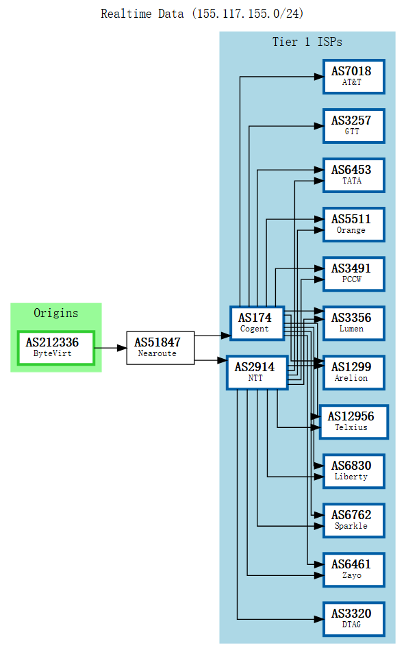

:::tip[观前提示]
本帖无任何 AFF 链接, 可放心食用, 所有评价皆为个人观点喵
测试机型: [`VPS-2048-KVM-JP`](https://bytevirt.com/store/vps-jp-kvm)
:::

## 机器规格
https://bytevirt.com/store/vps-jp-kvm

## 💻基本信息
```bash
Basic System Information:
---------------------------------
Uptime     : 0 days, 0 hours, 44 minutes
Processor  : AMD EPYC 7C13 64-Core Processor
CPU cores  : 2 @ 1996.250 MHz
AES-NI     : ✔ Enabled
VM-x/AMD-V : ✔ Enabled
RAM        : 1.9 GiB
Swap       : 256.0 MiB
Disk       : 15.0 GiB
Distro     : Debian GNU/Linux 12 (bookworm)
Kernel     : 6.1.0-38-cloud-amd64
VM Type    : STANDARD PC (I440FX + PIIX, 1996)
IPv4/IPv6  : ✔ Online / ✔ Online

IPv6 Network Information:
---------------------------------
ISP        : Siegfrieds Mechanisches Musikkabinett GmbH
ASN        : AS212336 ByteVirt LLC
Host       : ByteVirtJP
Location   : Tokyo, Tokyo (13)
Country    : Japan

fio Disk Speed Tests (Mixed R/W 50/50) (Partition -):
---------------------------------
Block Size | 4k            (IOPS) | 64k           (IOPS)
  ------   | ---            ----  | ----           ---- 
Read       | 12.94 MB/s    (3.2k) | 808.21 MB/s  (12.6k)
Write      | 12.95 MB/s    (3.2k) | 812.46 MB/s  (12.6k)
Total      | 25.89 MB/s    (6.4k) | 1.62 GB/s    (25.3k)
           |                      |                     
Block Size | 512k          (IOPS) | 1m            (IOPS)
  ------   | ---            ----  | ----           ---- 
Read       | 207.27 MB/s    (404) | 451.91 MB/s    (441)
Write      | 218.28 MB/s    (426) | 482.01 MB/s    (470)
Total      | 425.55 MB/s    (830) | 933.93 MB/s    (911)

Geekbench 5 Benchmark Test:
---------------------------------
Test            | Value                         
                |                               
Single Core     | 838                           
Multi Core      | 1603                          
Full Test       | https://browser.geekbench.com/v5/cpu/23873022

 SysBench CPU 测试 (Fast Mode, 1-Pass @ 5sec)
---------------------------------
 1 线程测试(单核)得分:          2873 Scores
 2 线程测试(多核)得分:          6053 Scores
 SysBench 内存测试 (Fast Mode, 1-Pass @ 5sec)
---------------------------------
 单线程读测试:          36932.95 MB/s
 单线程写测试:          22559.95 MB/s
```

## 🎬IP质量

:::note
IPV4解锁不错
:::

 

## BGP信息



## 🌐网络质量

:::note
网络表现一坨希 适合当落地鸡 ~~反正他便宜~~
:::

 

## 📍回程路由
 