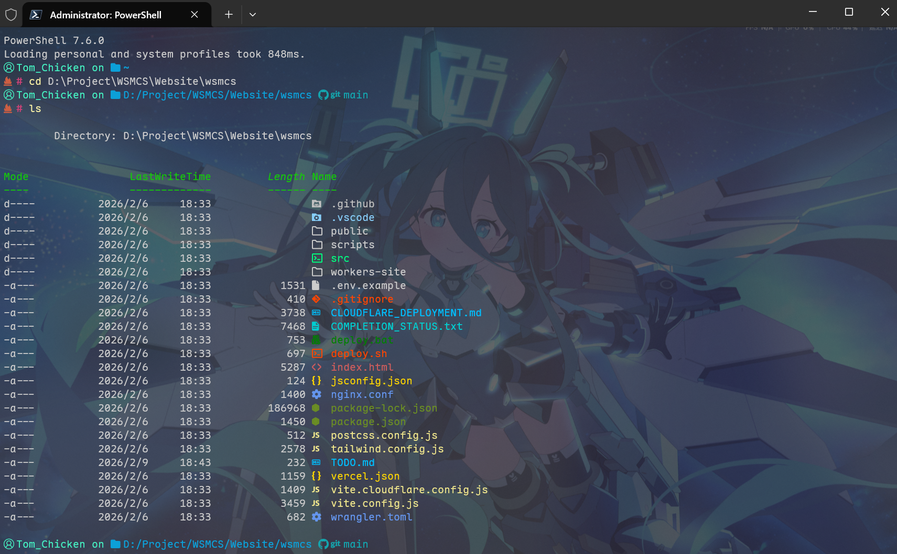
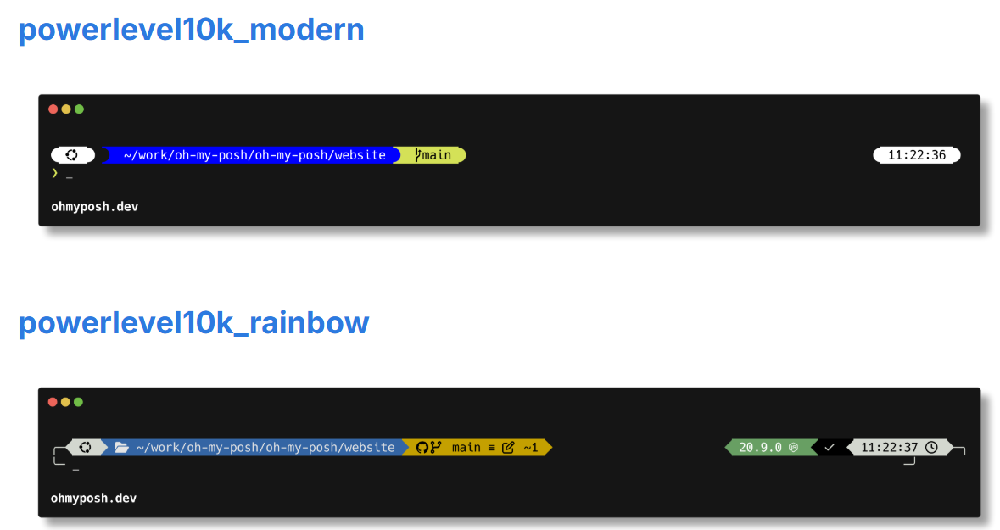

## 前言
> Windows PowerShell 默认主题太丑了用着还难受，~~滚出去！（黑手哥音）~~  
> 本教程带大家美化自己的 PowerShell 终端 提升终端使用体验  
> emmm 这篇写了好久感觉有些好用的可以改变终端体验的工具有点多 我到时候单开一篇文章具体介绍吧

## Oh My Posh 官网
https://ohmyposh.dev/  
文档：https://ohmyposh.dev/docs/
::github{repo="jandedobbeleer/oh-my-posh"}

## 软件简介
**Oh My Posh** 是一款基于 Go 语言的跨平台终端美化工具，它能让你的 PowerShell 彻底告别蓝底白字：

- 🎨 **深度定制**：从色彩方案到逻辑片段，所有元素均可按需自由定制。
- 📦 **预设丰富**：拥有数百款精美主题模板，安装即用，总有一款适合你。
- 🧠 **智能感知**：动态显示 Git 分支、环境版本等 180+ 数据模块。
- ⚡ **高性能**：基于 Go 构建，支持异步加载。
- 🌍 **配置通用**：一份配置全平台通用，在 Windows、macOS 与 Linux 间无缝迁移。

废话少说，上图

<p align="center" style="color: gray; font-size: 14px; margin-top: -10px;">此处使用 amro 主题做演示</p>  

> 我喜欢简约所以用的amro 其实你们应该更熟悉这种风格  
> ~~懒得再配一遍了~~，直接上官方文档中演示截的图


<p align="center" style="color: gray; font-size: 14px; margin-top: -10px;">此处使用 powerlevel10k 主题做演示</p>

## 前置条件
- 已安装 **Windows Terminal**  （Windows 11 自带，Windows 10 需要在 Microsoft Store 安装）
- 已安装 **PowerShell**
:::warning
此处的 `PowerShell` 不是系统自带的 `Windows PowerShell` 的缩写，两者不是同一个东西
:::
::github{repo="PowerShell/PowerShell"}  
推荐使用 `Scoop` 安装 Powershell，[Scoop 使用教程](https://blog.tomchicken.icu/posts/tools/scoop/quickstart/)  

```powershell
scoop install pwsh
```
当然你也可以用 winget 或者其他方法安装，此处不赘述


- 已安装 支持 **Nerd-Font** 的字体

此处推荐 `Maple Mono NF CN` ，`Maple Mono` 是一个开源的圆角等宽编程字体，支持连字、Nerd-Font 图标
::github{repo="subframe7536/maple-font"}  
推荐使用 `Scoop` 安装 `Maple Mono NF CN`，[Scoop 使用教程](https://blog.tomchicken.icu/posts/tools/scoop/quickstart/)
```powershell
# 先添加 nerd-font 桶
scoop bucket add nerd-fonts
# 安装 Maple Mono NF CN
scoop install Maple-Mono-NF-CN
```


## 软件安装

### 1. 修改 Windows Terminal 字体
进入 **Windows Terminal** 的设置，将 `外观` -> `字体` 的值修改为 **支持 Nerd-Font** 的字体，如 `Maple Mono NF CN`
### 2. 安装 Oh My Posh 本体
推荐使用 `Scoop` 安装 `Oh My Posh`，[Scoop 使用教程](https://blog.tomchicken.icu/posts/tools/scoop/quickstart/)  
```powershell
scoop install oh-my-posh
```

:::tip
此时 `Oh My Posh` 还没有“接管”你的终端，我们需要在 PowerShell 的配置文件中对其进行初始化。
:::

### 3. 持久化生效配置  
在终端输入以下命令编辑你的 PowerShell 配置文件：
:::tip
如果提示文件不存在请使用以下命令创建它
`New-Item -ItemType File -Path $PROFILE -Force`
:::
```powershell
notepad $PROFILE
```


在打开的记事本末尾，添加以下内容：

```powershell
oh-my-posh init pwsh | Invoke-Expression
```

添加完成后保存，输入如下命令重载或直接重启终端生效
```powershell
. $PROFILE
```

恭喜，现在 `Oh My Posh` 已经“接管”你的终端了

## 软件配置
:::tip
如果你有足够的能力自定义一个主题请移步参考[官方文档](https://ohmyposh.dev/docs/) ~~不过这种佬也不会看得到这篇博文罢~~
:::

### 0. 先去挑一个你喜欢的主题
[官方预设](https://ohmyposh.dev/docs/themes)
### 1. 持久化生效配置
选好主题后（这里用 amro 举例），重新编辑 PowerShell 配置文件：
```powershell
notepad $PROFILE
```
将刚刚初始化 Oh My Posh 的那行修改为带 `--config` 参数的形式：
```powershell
# 修改前：oh-my-posh init pwsh | Invoke-Expression
# 修改后（以 amro 为例）：
oh-my-posh init pwsh --config "$env:POSH_THEMES_PATH\amro.omp.json" | Invoke-Expression
```
修改完成后保存，输入如下命令重载或直接重启终端生效
```powershell
. $PROFILE
```

## Terminal-icon 额外的图标库
amro 演示图中列出的文件还根据后缀名类型显示了不同颜色和图标，这是因为额外添加了图标库  
### 1.安装 Terminal-icon
同样推荐用 `Scoop` 安装
```powershell
scoop install terminal-icons
```
### 2.持久化生效配置
编辑 PowerShell 配置文件
```powershell
notepad $PROFILE
```
在配置文件中添加这一行
```powershell
Import-Module -Name Terminal-Icons
```

## 提升终端体验の实用工具（预告）

除了视觉上的美化，想要让 PowerShell 真正好用，可能还需要更多工具比如：
- 🦇 **bat**：带语法高亮和行号的 `cat` 增强版
- 🚀**zoxide**：比 `cd` 更聪明的智能路径跳转工具。
- 📂**eza**：现代化的目录列表工具，完美配合 Terminal-Icons。
- 🔍**fzf**：命令行模糊搜索神器（TUI太爽了你们知道吗）。

由于~~懒癌发作~~篇幅有限，这些能够极大提升效率的工具，我将在下一篇文章中详细介绍。
> ~~下次一定~~

## 总结

到这里，你的 PowerShell 已经完成了从 “能用” 到 “好用” 的蜕变（x。

美化终端不仅仅是为了感官上的愉悦，更是为了在枯燥的开发和运维工作中，给自己营造一个更具掌控感和舒适度的环境  
希望这篇教程能帮到你打造出心仪的终端

> ~~冷知识 最后一行是 Gemini 写的~~

**⚡快去体验命令行的魅力吧⚡** 