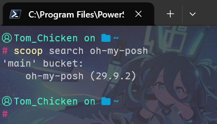

## Scoop 官网：
https://scoop.sh/  
::github{repo="ScoopInstaller/Scoop"}


## 软件简介

**Scoop** 是 Windows 上最舒适的开源**命令行包管理器**。它可以方便地安装、管理和更新各种常用的软件和工具，彻底告别“找官网 -> 下包 -> 狂点下一步”的原始操作 ~~（对的我连鼠标都懒得碰 这真的很爽）~~ 。  


### 特点

-   **纯命令行**：全过程命令行操作，任何操作只需要一行命令，~~爽就完了~~
-   **软件管理**：功能强大，类似于Linux系统下的apt，yum和pacman，支持自动更新软件，卸载软件以及回滚软件到特定版本
-   **纯净绿色**：软件默认统一安装在 `~/scoop` 目录下，不污染注册表，保证软件灵活性和系统环境的干净
-   **自动处理环境变量**：安装即用，Scoop 自动处理 `PATH`，无需手动配置
-   **开源社区支持**：Scoop 拥有强大的开源社区支持，用户可以在 Scoop 中设置各种第三方软件源，以此来安装更多的软件
   

## 前置条件
- `PowerShell` 版本  >=  5.1  

按下 `Win + R` 键、输入`powershell`并确认以打开 PowerShell，执行如下命令查看当前 Powershell 版本
```powershell
$PSVersionTable.PSVersion
```
你应该会得到形如如下的输出
```powershell
> # $PSVersionTable.PSVersion

Major  Minor  Patch  PreReleaseLabel BuildLabel
-----  -----  -----  --------------- ----------
7      6      0
```
此处的输出即为你当前的 PowerShell 版本号，演示中的 PowerShell 版本号为 `7.6.0`


## 软件安装

#### 0. 指定路径（可选）
Scoop 默认会将软件安装到 ~\scoop 目录，打开 Powershell 终端，执行如下命令指定 Scoop 将其安装到其他路径
```powershell
$env:SCOOP='这里修改为安装目录'
```
#### 1. 打开 Powershell 终端，执行如下命令：
```powershell
# 允许执行远程脚本
Set-ExecutionPolicy -ExecutionPolicy RemoteSigned -Scope CurrentUser
# 下载并运行 scoop 安装脚本
Invoke-RestMethod -Uri https://get.scoop.sh | Invoke-Expression
```

#### 2. 验证安装
安装完成后执行`scoop --version`，若能正常显示版本即安装成功

## 软件配置  

### 添加桶

Scoop 安装完成后，默认只带 `main` 仓库，所以推荐添加其他的 bucket （即软件桶，可以理解为软件源） 

#### 1. 添加自定义桶需要 git 环境，打开 Powershell 终端，键入如下命令安装 git （若已有 git 环境可跳过这一步）
```powershell
scoop install git
```

#### 2. 添加 `extra`、`nerd-fonts` 桶
```powershell
scoop bucket add extras
scoop bucket add nerd-fonts
```
当然你也可以通过该命令添加其他软件桶

### 安装 scoop-search

Scoop 可以使用 `scoop search 软件名` 命令搜索软件，但该命令的效率较低，因此我们需要安装 `scoop-search` 替代 Scoop 自带的搜索

1. 打开 Powershell 终端，键入如下命令安装 `scoop-search`
```powershell
scoop install scoop-search
```

2. **设置命令别名** （可选）
:::note
scoop-search 的调用命令默认为 `scoop-search.exe <term>`   
每次键入会有些麻烦，所以可以修改配置文件，让 `scoop-search` 接管 `scoop search` 命令
:::

打开 Powershell 终端，键入如下命令使用记事本编辑 Powershell 终端的配置文件
```powershell
notepad $PROFILE
```
在配置文件中添加这一行
```ps1
. ([ScriptBlock]::Create((& scoop-search --hook | Out-String)))
```
保存更改，重启 Powershell 终端生效

## 常用命令

### 搜索软件
```bash
scoop search <软件名>
```
支持模糊搜索，会返回包含该关键字的软件名称和对应的bucket，如图所示


### 安装软件
- 不指明bucket，由Scoop自动匹配
```powershell
scoop install <软件名>
```
- 指明bucket，安装指定的bucket中对应的软件
```powershell
scoop install <bucket名>/<软件名>
```

### 查看软件列表
```powershell
scoop list
```

### 更新软件
- 更新指定软件
```powershell
scoop update <软件名>
```
- 更新所有软件
```powershell
scoop update *
```

### 卸载软件
```powershell
scoop uninstall <软件名>
```
如果在卸载软件时还要同时清除配置文件，则需要执行以下命令
```powershell
scoop uninstall <软件名> -p
```
